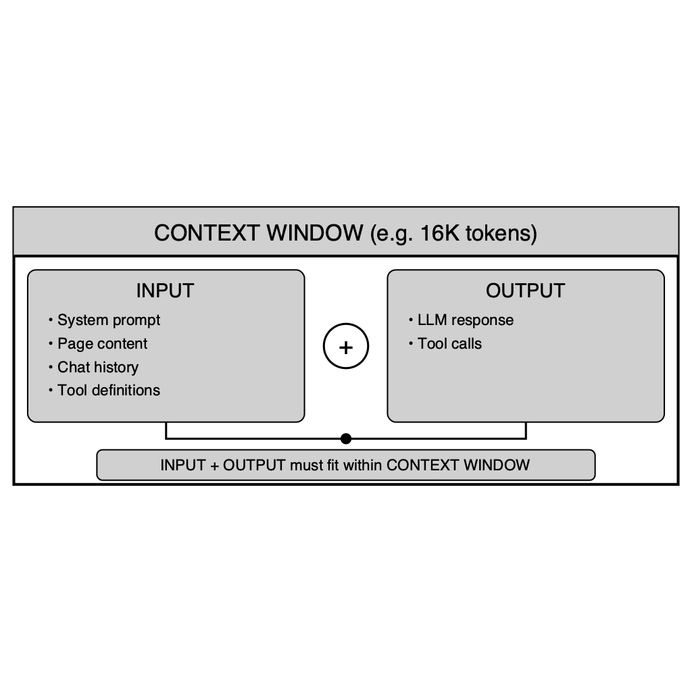

# LLM Max Token

Token limit handling with external model database from models.dev.

## Overview

- Fetch model limits (context window, output limit) from models.dev
- Color-coded UI feedback: green (within limits), orange (unknown model), red (exceeds limits)
- Automatic page content truncation when exceeding available space
- Help popover with visual diagram explaining token concepts

## Models.dev Integration

**API**: `https://models.dev/api.json` - returns nested JSON by provider with model limits.

**Cache**: Stored in `~/Library/Application Support/SafarAI/models.json`. Refreshed on app launch if older than 7 days (non-blocking background fetch).

**Model Matching**: Normalizes to lowercase, then tries exact match → user input as prefix of DB model → DB model as prefix of user input → unknown.

## UI: Profile Form

**Help button** (?) next to "Model Configuration" opens a popover with a diagram explaining context windows:

**Color-coded model status**:
- **Green**: Within known limits - shows context and output limits
- **Orange**: Unknown model - "Verify limits with your provider"
- **Red**: User's settings exceed known model limits

**Sliders** for Max Tokens and Context Limit with "Set to max/default" buttons for known models.

**Truncation notice** explains that page content will be truncated if it exceeds available space.

## Implementation

| File | Purpose |
|------|---------|
| `Services/ModelLimitsService.swift` | Fetch, cache, and lookup model limits |
| `Views/ProfileFormView.swift` | Color-coded feedback, help popover, limit sliders |
| `Services/AIService.swift` | Page content truncation in `chatOpenAI()` |
